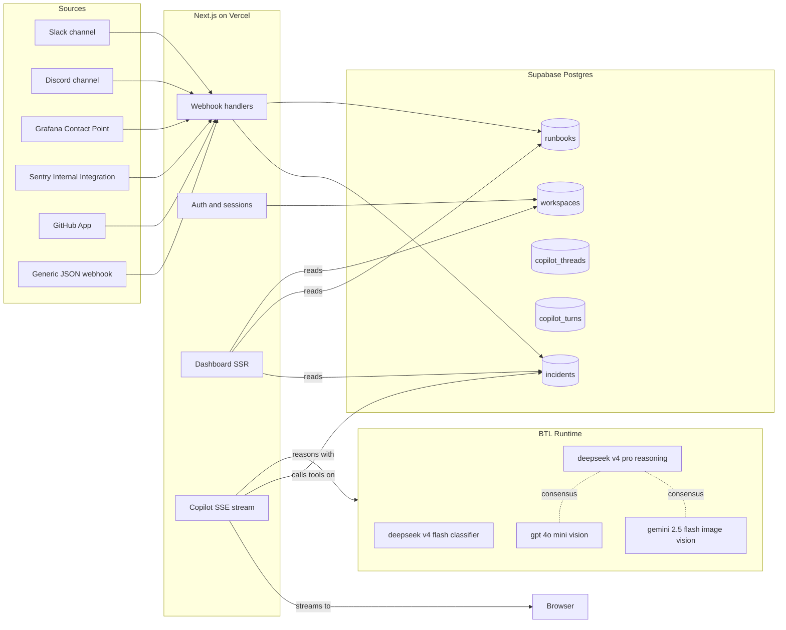
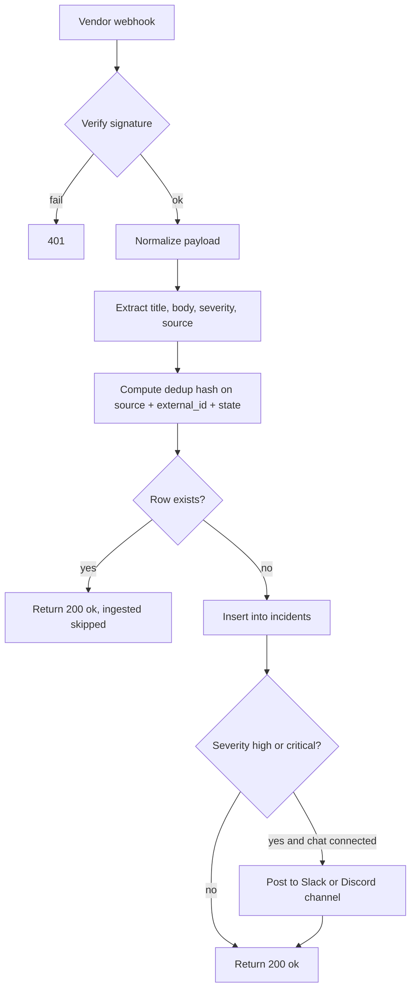
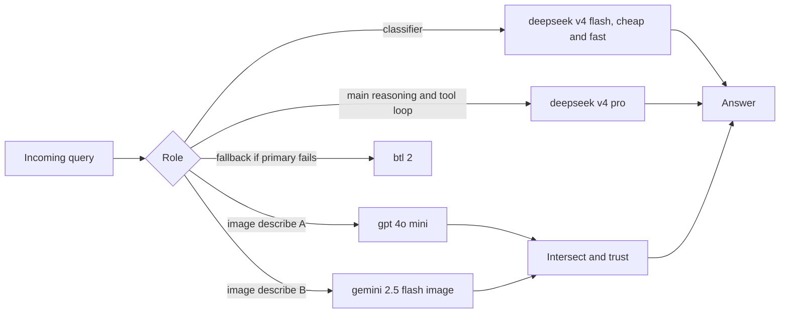
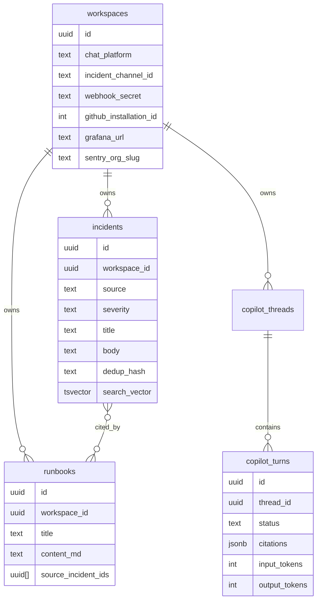

# Helena Labs

Incident memory for on-call teams. Live at helenalabs.vercel.app

Every alert a team fires lands in a searchable memory. When the next one hits, the Copilot points at the resolutions the team already worked out, with citations.

## System



## Ingestion



## Copilot query loop

```mermaid
sequenceDiagram
  participant U as User
  participant API as SSE endpoint
  participant CLS as Classifier
  participant LOOP as Tool loop
  participant DB as Postgres
  participant SYN as Synthesizer

  U->>API: question, thread_id, images
  API->>CLS: route this query
  CLS-->>API: intent, sources to try
  loop until answer or budget exhausted
    API->>LOOP: pick next tool
    LOOP->>DB: query_incidents or list_recent or fetch_runbook
    DB-->>LOOP: rows
    LOOP-->>API: tool result, maybe more calls
  end
  API->>SYN: compose final with citations
  SYN-->>API: text with INC-xxx and RB-xxx markers
  API->>API: validate every citation resolves
  alt any citation missing
    API->>SYN: retry with corrections
  end
  API-->>U: SSE final event
```

## Model routing



## Data model



## What is complex under the hood

- Multi tenant OAuth for Slack and Discord with cookie based sessions. Every read path is workspace scoped, no cross workspace leak surface
- Per workspace webhook secrets so a leaked secret only affects that one tenant
- Streaming SSE for the Copilot with named events (classified, tool_call, tool_result, delta, final, error) so the UI can render a live trace
- Tool use loop with citation validation and one automatic retry pass before shipping
- Synthesis reserve, the loop always keeps enough wall clock budget to compose a final answer even when tool calls run long
- Dual VLM consensus for screenshot uploads. Two models describe the same image, only claims both agree on are trusted
- GitHub App with signed JWT to installation token exchange, plus deployment webhooks enriched with commit title, author, and diff stats via the installation token
- Sentry Internal Integration flow that auto lists projects and creates alert rules pointing at the workspace webhook
- Grafana Contact Point auto created on the customer side via the Grafana API when the user pastes their token
- Postgres tsvector search vector with GIN index, kept in sync by a trigger, so text search stays under 50 ms even as the incident corpus grows
- Nightly cron that finds resolved incident threads, drafts runbooks with the reasoning model, saves as pending drafts
- Cookie based session tokens. Session tokens never appear in URLs
- Server components render the shell, client components handle drawer state and streaming
- Light and dark theme with CSS variable inversion so most utility classes flip automatically

## Stack

- Next.js 16 App Router on Vercel with Node runtime, maxDuration 60 s
- Supabase Postgres with tsvector FTS, GIN indexes, RLS
- BTL Runtime (OpenAI compatible gateway) for all LLM calls
- Slack app, Discord bot, Grafana Contact Point, Sentry Internal Integration, GitHub App, generic JSON webhook

## Monorepo layout

```
apps/web            Next.js dashboard + all API routes
packages/btl        BTL client wrapper, prompts, four LLM roles
packages/db         Supabase server client and typed queries
packages/shared     Types, zod schemas, dedup hash
```

## Local dev

```
pnpm install
cp .env.example .env.local
pnpm dev
```

Open http://localhost:3000

## Deploy

Push to main. Vercel picks up apps/web as the project root. Env vars from .env.example go into Vercel project settings.
